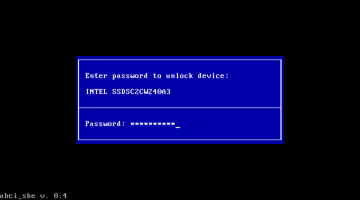
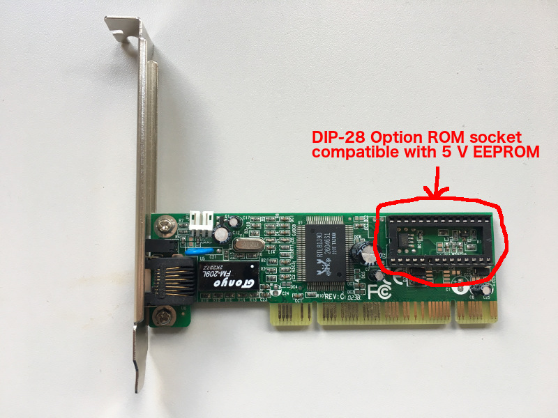
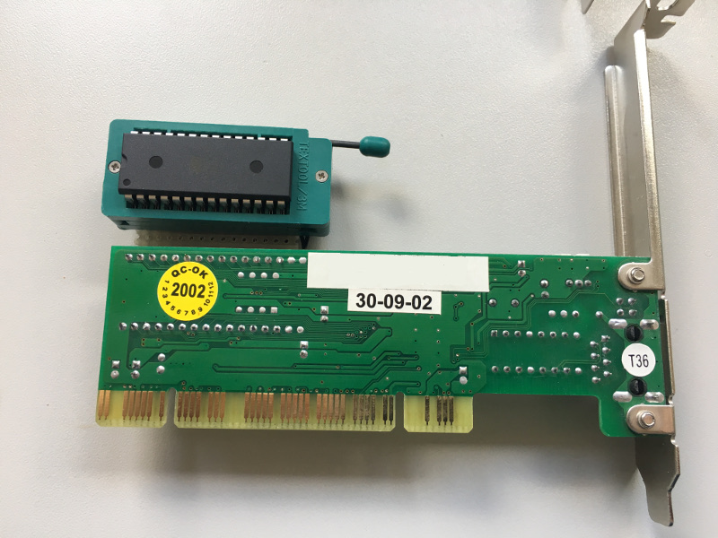

AHCI BIOS Security Extension
============================

This software is useful if

* you have a (probably self-encrypting) hard disk / solid state drive that supports the (S)ATA SECURITY command set 
* you want to boot from this drive.
* your motherboard's BIOS does <u>not</u> support asking the user for a hard disk password at startup
* you don't want to buy a new motherboard.
* the hard disk controller of your motherboard supports AHCI.

**This is a BIOS extension that runs before the operating system is started and allows you to enter passwords to unlock SATA drives.**

**Use at your own risk!**

New features in version 0.9:

* Support for multiple AHCI controllers (e. g. additional PCIe SATA cards)
* Press Shift+Enter for *Unlock multiple*: Enter password once and use it for multiple disks without having to type it again.

Screenshot:

Build / Installation
--------------------

### Method 1: PCI network adapter option ROM (recommended)

The option ROMs on network cards are meant to add an option for network boot to your computer, but the ROM can usually be replaced with whatever you want, for example ahci_sbe. Unfortunately, network boot and option ROMs are getting less popular nowadays and it gets harder to find suitable network cards.

I can recommend old network cards like this one to install ahci_sbe on:

This one uses the Realtek RTL8139 controller, which is my recommendation. Network cards with the RTL8139 are easy and cheap to find on the second hand market. The network card should come with an unpopulated DIP-28 socket, so you will also need to get a DIP-28 EEPROM as the actual option ROM. Any ROM that sells as 28C64 should be compatible. 
    
Side note: Many newer network cards, such as this one with the RTL8169 controller only support 3.3 volt ROMs. The DIP-32 socket deceptively suggests that plugging an actual ROM chip in here will be easy, but I have not been able to find a comptabile ROM anywhere. In theory, 3.3 volt ROMs compatible with the newer cards should be called "29LV040" or similar.

#### Flash the ROM

There are various ways to flash the option ROM of a network adapter. For example:

* Use the open-source [flashrom tool](https://www.flashrom.org/Flashrom) tool to flash ahci_sbe to your network card's option ROM. They have support for the RTL8139 with the flag <code>--programmer nicrealtek</code>.
* Use an EEPROM programmer (cheap option would be the TL866 from eBay) and flash the EEPROM before you put it in your card. This gives you the most freedom to experiment.

#### Advanced: Setting up a development platform for option ROMs

Use a EEPROM programmer on machine A and have your network card in machine B. For each "test cycle", write the new software to the ROM and plug it back into machine B's network card. To make plugging the ROM in and out more comfortable, install a ZIF socket on your network card, just like I did in the development phase:

#### Computers without PCI slots

If your motherboard only has PCIe slots, you obviously need a PCIe network card with option ROM (the option ROMs are then typically not DIP chips, but much smaller chips that use some serial interface). Intel makes a few such cards, but they are pricey and I did not try it.

I also had some reports where it did not work on recent boards. I suspect this has something to do with UEFI.

### Method 2: Modify BIOS image (not recommended)

I have not done this and do not recommend it. If you are unlucky and flash a faulty BIOS image to your motherboard, your motherboard will be unusable afterwards.

Troubleshooting: Error message "Port not idle"
----------------------------------------------

If this error appears, you can try to change line 225 in ahci.asm from the conditional jump <code>jz check\_port\_cmd\_ok</code> to the unconditional jump <code>jmp check\_port\_cmd\_ok</code>. This will work in some cases. Thanks to Chain for reporting the problem and fix. Instead of fixing it yourself in the source code, you can also download a fixed version of ahci_sbe 0.9 [here](https://github.com/TobiasKaiser/ahci_sbe/archive/port_not_idle_fix.zip).

Further reading
---------------

* This project inspired me to write ahci_sbe. It has more features, but only supports IDE, not AHCI controllers: http://www.fitzenreiter.de/ata/ata_eng.htm
* Information about flashing option ROMs: http://www.richud.com/wiki/Network_gPXE_and_iPXE_Flashrom_Intel_Pro_100
* Etherboot tutorial for flashing network card option ROMs: http://etherboot.org/wiki/index.php